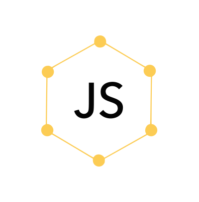

# Scaffold

[](https://badge.fury.io/js/%40js-ql%2Fscaffold)

Scaffold is a JavaScript library that is used to generate objects using templates inspired from GraphQL.

## Installation

```console
npm install --save @js-ql/scaffold
```

## Usage

### Simple Usage

```javascript
const { scaffold } = require('@js-ql/scaffold')

const queryString = `
{
  name
  age
}`

console.log(scaffold(queryString))

/*
{
  name: null,
  age: null
}
 */


```

### With Types

```javascript
const { scaffold } = require('@js-ql/scaffold')

const queryString = `
{
  name: String
  friends: Array
}
`


console.log(scaffold(queryString))
/*
{
  name: '',
  friends: [],
}
*/

```

### By Defining Schemas

```javascript
const { Registry } = require('@js-ql/scaffold')

const queryString = `
define Person {
  name: String
  friends: Array
}
`
// Initial Registration

Registry.register(queryString)

.
.
.

// When you need it

console.log(Registry.scaffold('Person'))

/*
{
  name: '',
  friends: [],
}
*/

```

### Multiple Schemas

```javascript
const { Registry } = require('@js-ql/scaffold')

const queryString = `
  define Friend {
    name
    age
  }
  define Person {
    name: String
    friends: Array
    bestFriend: Friend
  }`


Registry.register(queryString)

.
.
.

console.log(Registry.scaffold('Person'))

/*
{
  name: '',
  friends: [],
  bestFriend: {
    name: null,
    age: null
  }
}
*/

```

Note: Make sure that schemas that you want to use inside another schema are defined before you use it.
